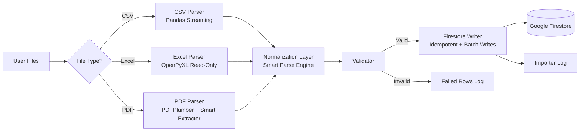
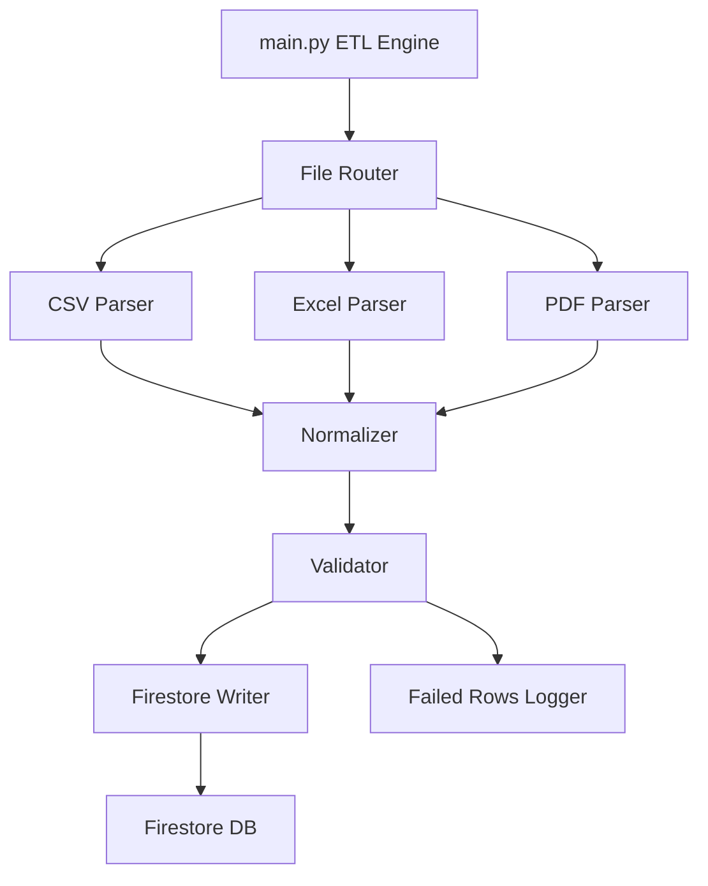
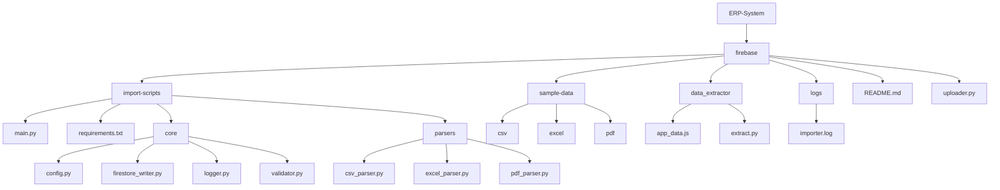

# ERP-System Firestore Import Engine

A **unified bridge for ERP data migration** into Google Firestore.  
This document outlines a robust, production-ready data ingestion ecosystem designed to eliminate manual data entry and ensure strict data integrity.  
The system acts as a universal adapter, capable of transforming unstructured and semi-structured business documents (CSV, Excel, PDF) into clean, Firestore-ready NoSQL documents.

The architecture consists of two synchronized components:

1. **A high-volume ETL Orchestrator** (backend bulk processing)  
2. **A Universal Interactive Uploader (`uploader.py`)** for single-file importing via CLI or GUI  

---

# Architecture Diagram



---

## Uploader Features: GUI Frontend & CLI Engine

| Feature Category | Description |
|------------------|-------------|
| **Dual Interaction Modes** | Supports both **GUI-based importing** (non-technical users) and **CLI-based importing** (developers & automation). |
| **Universal File Parsing** | Ingests **CSV, Excel, and all PDF formats** using a unified parsing engine supporting tables, JSON blocks, mixed records, and OCR-heavy text. |
| **Automatic File Type Detection** | Automatically identifies whether the input is CSV, XLSX/XLS, or PDF—no manual selection required. |
| **Advanced PDF Extraction** | Extracts structured tables, key-value pairs, JSON fragments, and partially broken JSON. |
| **Smart Normalization Layer** | Cleans data, normalizes keys, fixes OCR errors, expands lists/dicts, removes `(cid:###)` artifacts, and preserves long text fields. |
| **Duplicate Handling Modes** | **Unique Mode** (hash/natural-key deduplication) or **Append Mode** (auto-incremented Firestore IDs). |
| **Automatic Collection Naming** | Generates safe collection names from filenames when none is provided. |
| **Secure Firestore Integration** | Uploads via Service Account authentication, supporting both custom and default keys. |
| **Thread-Safe GUI Execution** | Uses background threads so the interface remains responsive during large imports. |
| **Detailed Logging & Metrics** | Tracks inserted, skipped, and failed records with full audit logs. |
| **User Feedback** | Displays a final summary after every import operation. |

---

## Pipeline Features (Bulk Import via `main.py`)

| Feature Category | Description |
|------------------|-------------|
| **Bulk Multi-Format Ingestion** | Processes all CSV, Excel, and PDF files inside `sample-data/`. |
| **Memory-Safe CSV Streaming** | Uses chunked streaming to handle very large CSV files. |
| **Excel Read-Only Mode** | Loads `.xlsx` sheets without loading the entire workbook into RAM. |
| **Advanced PDF Parsing** | Extracts structured and semi-structured datasets from enterprise PDFs. |
| **Smart Normalization Engine** | Converts nested keys, JSON strings, lists, and multi-line text into Firestore-safe structures. |
| **Idempotent Writes** | Hash-based change detection skips identical documents to reduce Firestore cost. |
| **Automated Subcollections** | Lists of dictionaries become subcollections; primitive lists stay inline. |
| **Error Isolation** | Invalid rows are isolated and logged without stopping the pipeline. |
| **Centralized Logging** | Logs stored inside `logs/importer.log`. |
| **Failed Row Tracking** | Problematic entries stored in `failed_rows/<collection>_failed.jsonl`. |

---

# Bulk Data Ingestion Pipeline Architecture



**Key Notes:**  
- Ideal for uploading **all CSV/Excel/PDF files together**  
- Automatically detects file formats  
- Best used for ERP-wide updates or admin-level batch jobs  

---

# Interaction Modes

This module follows a dual-interface architecture designed for both interactive desktop usage and automated backend execution.  
The ETL engine is fully separated from the interface layer for maximum maintainability.


## 1. Graphical User Interface (GUI)

**Entry Point:** `gui.py`  
A user-friendly interface built with CustomTkinter.

- Select files/folders interactively  
- Choose duplicate-handling behavior  
- Real-time logs in the UI  
- Background-thread processing for responsiveness  

---

## 2. Command Line Interface (CLI)

**Entry Point:** `uploader.py`  
A lightweight interface optimized for:

- CI/CD pipelines  
- SSH sessions  
- Linux servers  
- Automated workflows  

Provides instant terminal output with zero GUI dependencies.

---

# Core Engine (`uploader.py`)

Both GUI and CLI rely on the same backend engine:

- **Extraction** — Reads PDF, CSV, Excel  
- **Transformation** — Key normalization, OCR fixes, type inference, hash generation  
- **Loading** — Safe Firestore writes, duplicate handling, batch writes, error logging  

All business logic is centralized in this module.

---

# Uploader Architectural Flow


---

# Directory Breakdown



---

# JavaScript Data Extractor (`extract.py`)

`extract.py` converts JavaScript constant arrays (e.g., `const users = [...]`) into structured **CSV**, **Excel**, and **PDF** formats for backend ingestion.

---

### Key Features

| Feature | Description |
|--------|-------------|
| **Automatic .js Parsing** | Detects all top-level `const name = [ ... ]` arrays. |
| **JavaScript → JSON Normalization** | Cleans comments, quotes bare keys, fixes quotes, removes trailing commas. |
| **Nested Key Expansion** | Converts `"a.b.c"` → `{ "a": { "b": { "c": ... }}}`. |
| **Multiple Export Formats** | Exports each dataset to CSV, Excel, PDF, or all formats. |
| **GUI File Picker** | Select `.js` files via Tkinter dialog. |
| **Safe Output Directory** | Outputs to `sample-data/` automatically. |
| **Error-Resilient Parsing** | Handles common JS formatting issues gracefully. |

---

### Short Workflow

1. Select `.js` file using graphical file picker  
2. Script detects all arrays  
3. Extracts & normalizes JavaScript → JSON  
4. Expands nested keys  
5. Exports to CSV / Excel / PDF  

---

# Installation

```bash
pip install -r import-scripts/requirements.txt
```

---

# How to Use

### Run in **CLI Mode**
```bash
python uploader.py
```

### Run in **GUI Mode**
```bash
python gui.py
```

### Upload All CSV Files
```bash
python import-scripts/parsers/csv_parser.py
```

### Upload All Excel Files
```bash
python import-scripts/parsers/excel_parser.py
```

### Upload All PDF Files
```bash
python import-scripts/parsers/pdf_parser.py
```

### Upload Everything
```bash
python import-scripts/main.py
```

---

# Future Enhancements

- Improved GUI uploader  
- Full web dashboard  
- AI-based PDF structure learning  
- Schema inference  
- Multi-threaded ingestion  

---

# Troubleshooting

### Logs
```bash
logs/importer.log
```

### Failed Rows
```bash
failed_rows/<collection>_failed.jsonl
```
